# Decision v2: arquitectura objetivo del digest

Estado: implementado en modo sombra; pendiente de aplicar la migración, activar la configuración y evaluar resultados reales antes de cualquier sustitución en producción.

Este documento describe el sistema final de decisión de alertas para los digests de Ruralicos y el modo seguro de construirlo en paralelo. Es la referencia para futuras sesiones de desarrollo de `decision-v2`.

No describe MIA. MIA se reconstruirá en una fase posterior, cuando `decision-v2` esté validado y sea el motor de producción.

## 1. Decisión arquitectónica

El núcleo debe ser deliberadamente simple en número de autoridades y reglas:

```text
alertas oficiales + perfil del usuario
  -> filtros objetivos
  -> una decisión LLM conjunta por usuario
  -> persistencia de la decisión
  -> digest y entrega existentes
```

El LLM es la única autoridad semántica. Ningún clasificador, score, selector, segunda opinión o validador posterior puede reinterpretar si una alerta es relevante para el usuario.

Los controles deterministas se limitan a invariantes objetivas: fuente oficial, territorio, duplicados, historial de envíos y exclusiones inequívocas de producto.

Esto no significa construir una prueba de concepto parcial. Se implementará el recorrido completo de v2 en sombra: carga real de datos, filtros, decisión conjunta, persistencia, ejecución diaria, comparación, corpus de regresión y observabilidad suficiente para evaluar su calidad. Lo único que quedará desconectado será la creación y entrega real de digests.

## 2. Arquitectura final de producción

```mermaid
flowchart TB
    START["Ejecución diaria<br/>run_digest_workflow.js"]

    subgraph EXISTENTE1["A. Captura existente — no se reconstruye"]
        SCRAPERS["Ejecutar scrapers"]
        NORMALIZAR["Normalizar publicación<br/>título · organismo · territorio<br/>fecha · URL · contenido"]
        DEDUPDOC{"¿La publicación<br/>ya existe?"}
        IGNORAR["Ignorar duplicado<br/>o completar el registro existente"]
        ALERTAS[("Guardar alerta y documento oficial")]
    end

    subgraph PREPARAR["B. Preparación de cada usuario"]
        USUARIOS[("Cargar usuarios activos")]
        PERFIL["Cargar perfil completo<br/>territorios · actividades<br/>preferencias · suscripción"]
        PERIODO["Cargar alertas del periodo<br/>sin usar listo/descartado como barrera"]
        HISTORIAL["Cargar alertas ya enviadas<br/>a ese usuario"]
    end

    subgraph V2["C. decision-v2 — única pieza nueva"]
        HARDSTART["Examinar cada alerta"]
        SOURCE{"¿Tiene documento<br/>o URL oficial válida?"}
        TERRITORY{"¿El territorio es<br/>compatible?"}
        SENT{"¿Ya fue enviada<br/>a este usuario?"}
        EXPLICIT{"¿Existe una exclusión<br/>objetiva e inequívoca?"}
        HARDOUT["Excluir por regla objetiva<br/>y registrar el motivo"]
        CANDIDATE["Añadir a candidatas"]
        PAYLOAD["Construir una única petición<br/>perfil + todas las candidatas<br/>+ contenido oficial"]
        CALL["Una llamada al LLM<br/>para ese usuario"]
        SEMANTIC["El LLM compara y decide<br/>relevancia · evidencia rural<br/>prioridad · máximo de elementos"]
        RESPONSE["Respuesta estructurada<br/>incluidas ordenadas<br/>excluidas con motivo<br/>evidencia utilizada"]
        FORMAT{"¿Respuesta técnicamente válida?"}
        RETRY["Reintentar una vez<br/>corrigiendo sólo el formato"]
        SECOND{"¿Segundo resultado válido?"}
        FAILURE["Registrar error técnico<br/>no enviar a este usuario"]
        VALID["Aceptar la decisión<br/>sin reinterpretarla"]
    end

    subgraph REPOSITORY["D. Registro de la decisión"]
        RUN[("Guardar ejecución<br/>usuario · modelo · versión<br/>perfil y candidatas utilizadas")]
        DECISIONS[("Guardar cada resultado<br/>incluir/excluir · prioridad<br/>motivo · evidencia")]
    end

    subgraph EXISTENTE2["E. Digest y entrega existentes"]
        SELECTED["Tomar alertas incluidas<br/>en el orden decidido por el LLM"]
        RECHECK{"Comprobación transaccional<br/>¿usuario-alerta ya enviada?"}
        SKIP["Omitir duplicado"]
        ITEMS[("Crear digest_items")]
        MESSAGE["Construir el mensaje<br/>sin cambiar la selección<br/>ni inventar información"]
        DIGEST[("Crear digest")]
        OUTBOX{"Crear evento idempotente<br/>en WhatsApp outbox"}
        SEND["Enviar al proveedor"]
        PROVIDER{"Respuesta del proveedor"}
        ACK["Actualizar ACK y estado"]
        LOGS[("Guardar logs de envío")]
    end

    subgraph TRACE["F. Trazabilidad"]
        CHAIN["Alerta → decisión → digest_item<br/>→ digest → outbox → proveedor"]
        DAILY["Resumen diario<br/>decididas · incluidas · excluidas<br/>errores · envíos"]
    end

    START --> SCRAPERS
    SCRAPERS --> NORMALIZAR
    NORMALIZAR --> DEDUPDOC
    DEDUPDOC -->|sí| IGNORAR
    DEDUPDOC -->|no| ALERTAS
    ALERTAS --> PERIODO
    START --> USUARIOS
    USUARIOS --> PERFIL
    PERFIL --> HISTORIAL
    PERFIL --> HARDSTART
    PERIODO --> HARDSTART
    HISTORIAL --> HARDSTART
    HARDSTART --> SOURCE
    SOURCE -->|no| HARDOUT
    SOURCE -->|sí| TERRITORY
    TERRITORY -->|no| HARDOUT
    TERRITORY -->|sí| SENT
    SENT -->|sí| HARDOUT
    SENT -->|no| EXPLICIT
    EXPLICIT -->|sí| HARDOUT
    EXPLICIT -->|no| CANDIDATE
    CANDIDATE --> PAYLOAD
    PERFIL --> PAYLOAD
    PAYLOAD --> CALL
    CALL --> SEMANTIC
    SEMANTIC --> RESPONSE
    RESPONSE --> FORMAT
    FORMAT -->|sí| VALID
    FORMAT -->|no| RETRY
    RETRY --> SECOND
    SECOND -->|sí| VALID
    SECOND -->|no| FAILURE
    VALID --> RUN
    VALID --> DECISIONS
    HARDOUT --> DECISIONS
    FAILURE --> RUN
    DECISIONS --> SELECTED
    SELECTED --> RECHECK
    RECHECK -->|sí| SKIP
    RECHECK -->|no| ITEMS
    ITEMS --> MESSAGE
    MESSAGE --> DIGEST
    DIGEST --> OUTBOX
    OUTBOX -->|evento nuevo| SEND
    OUTBOX -->|evento ya existente| SKIP
    SEND --> PROVIDER
    PROVIDER --> ACK
    ACK --> LOGS
    DECISIONS --> CHAIN
    ITEMS --> CHAIN
    DIGEST --> CHAIN
    OUTBOX --> CHAIN
    LOGS --> CHAIN
    CHAIN --> DAILY
```



Aunque el diagrama muestra todos los pasos operativos, el único núcleo nuevo es:

```text
cargar datos
  -> aplicar filtros objetivos
  -> llamar una vez al LLM
  -> validar el formato
  -> guardar la decisión
```

## 3. Qué se conserva

- Scrapers y descarga de documentos oficiales.
- Normalización de publicaciones.
- Deduplicación entre publicaciones.
- Perfiles y preferencias de usuarios.
- Historial de alertas enviadas.
- Creación de `digests` y `digest_items`.
- Composición del mensaje, inicialmente sin intentar mejorar su estilo.
- Outbox e idempotencia de WhatsApp.
- Integración con el proveedor, logs y ACK.

La reconstrucción no debe reescribir estas piezas salvo que aparezca un defecto imprescindible para integrar `decision-v2`.

## 4. Qué se sustituirá

Una vez validado y activado `decision-v2`, dejarán de participar en la selección:

- Clasificación global rural/no rural como autoridad de acceso al digest.
- `estado_ia="listo"` y `estado_ia="descartado"` como barreras semánticas.
- Selector heurístico por usuario.
- Scores y `topK` previos al decisor.
- Fact sheets como barreras bloqueantes.
- `candidatePipeline` como autoridad semántica.
- Juez individual por alerta.
- Segunda opinión y reconciliación.
- Estados `HOLD`.
- Fallbacks que conviertan incertidumbre en inclusión.
- Validadores semánticos posteriores al LLM.

No se eliminará el código antiguo durante la construcción en sombra. Su retirada será una fase separada posterior a la activación y estabilización de v2.

## 5. Universo de alertas

`decision-v2` debe partir de las alertas válidamente ingeridas en el periodo, aunque el clasificador actual las haya marcado como `listo`, `descartado` o `pendiente_revision_manual`.

Si v2 sólo recibe alertas `listo`, heredará falsos negativos del sistema antiguo y no cumplirá su propósito.

Los estados actuales pueden conservarse como metadatos de comparación durante la sombra, pero no deben bloquear el acceso al nuevo decisor.

## 6. Filtros objetivos permitidos

Una alerta puede quedar fuera antes del LLM únicamente cuando exista una razón verificable y no semántica:

1. No existe URL o documento oficial utilizable.
2. El territorio oficial es incompatible con el ámbito aceptado por el usuario.
3. La publicación está duplicada.
4. La alerta ya fue enviada a ese usuario.
5. El usuario desactivó explícitamente un tipo cuya identificación es inequívoca.
6. Existe otra exclusión de producto objetiva e inequívoca, por ejemplo un acto individual correctamente identificado si la política vigente decide no difundirlos.

No son filtros duros válidos:

- Sector inferido por un resumen generado.
- Etiquetas rurales o no rurales.
- Scores, embeddings o similitud.
- Confianza del clasificador anterior.
- Beneficiarios desconocidos.
- Acción o plazo no detectados.
- Fecha límite vencida por sí sola.
- Ausencia de actividad extraída cuando el texto oficial puede contenerla.

## 7. Los tres niveles de deduplicación

Los tres se conservan porque protegen problemas distintos:

1. **Publicación:** evita almacenar varias veces la misma disposición o documento.
2. **Usuario-alerta:** evita volver a seleccionar algo ya comunicado al mismo usuario.
3. **Outbox:** evita repetir físicamente un envío cuando existen reintentos, carreras o ejecuciones duplicadas.

Ninguno de estos controles decide relevancia semántica.

## 8. Entrada del LLM

La decisión es conjunta por usuario, no una llamada por cada alerta.

La petición debe incluir un snapshot suficiente para reproducir la decisión.

### Perfil

- Identificador técnico del usuario.
- Territorios admitidos.
- Actividades y sectores declarados.
- Tipo de entidad o beneficiario cuando esté explícitamente declarado.
- Tipos de contenido solicitados.
- Preferencias, inclusiones y exclusiones expresas.
- Contexto adicional relevante del perfil.

El plan de suscripción no puede utilizarse para inferir el tipo legal del beneficiario.

### Cada candidata

- `alerta_id`.
- Título oficial o título disponible.
- Organismo y fuente.
- Territorio respaldado.
- Fecha de publicación y fechas relevantes.
- URL oficial.
- Objeto o fragmentos originales del documento.
- Beneficiarios y actividad extraídos, si existen.
- Cualquier resumen o taxonomía auxiliar marcado expresamente como dato derivado y no como evidencia.

El contenido original y la URL oficial prevalecen sobre resúmenes, etiquetas o taxonomías generadas.

## 9. Política de decisión

El LLM debe comparar todas las candidatas y elegir como máximo el número configurado para el digest.

Para cada alerta debe decidir `include` o `exclude`. No existe `HOLD`, votación ni segunda autoridad.

La política de producto es:

- Favorecer cobertura cuando exista una relación rural plausible respaldada.
- No exigir que todos los campos estén detectados para incluir.
- Exigir alguna evidencia real de relación con el perfil o con el ámbito rural del producto.
- No convertir la simple incertidumbre en inclusión cuando falta esa evidencia.
- Priorizar las alertas más accionables o relevantes frente a las informativas secundarias.
- No inventar beneficiarios, actividades, territorios, plazos ni requisitos.

## 10. Contrato de salida conceptual

La forma definitiva se fijará al implementar y se versionará. Como mínimo debe representar:

```json
{
  "decision_version": "decision-v2",
  "user_id": "<uuid>",
  "included": [
    {
      "alert_id": 123,
      "priority": 1,
      "reason": "Relación concreta con el perfil",
      "evidence": ["Fragmento o hecho verificable utilizado"]
    }
  ],
  "excluded": [
    {
      "alert_id": 456,
      "reason": "No existe relación rural o personal respaldada",
      "evidence": ["Fragmento o hecho que sostiene la exclusión"]
    }
  ]
}
```

Todas las candidatas deben aparecer exactamente una vez entre `included` y `excluded`.

## 11. Validación posterior permitida

Después del LLM sólo se valida el contrato técnico:

- JSON válido.
- Versión reconocida.
- Usuario esperado.
- IDs pertenecientes al conjunto entregado.
- Cada candidata aparece una vez.
- No hay duplicados.
- No se supera el máximo de elementos.
- Motivo y evidencia están presentes.
- Las incluidas conservan URL y territorio válidos.

Si el contrato es inválido, se permite un único reintento orientado a corregir formato. El reintento no pide una segunda opinión semántica.

Si vuelve a fallar, la ejecución del usuario se registra como error y no se fabrica una selección alternativa.

## 12. Persistencia y trazabilidad

Debe existir un único repositorio lógico para guardar:

- ID de ejecución.
- Fecha del workflow.
- Usuario.
- Modelo y versión del prompt.
- Snapshot o referencia reproducible del perfil.
- IDs de todas las candidatas.
- Exclusiones objetivas previas y sus códigos.
- Respuesta bruta del modelo cuando sea seguro conservarla.
- Decisión normalizada por alerta.
- Motivos y evidencias.
- Tokens, duración y error técnico.
- Digest simulado completo, incluido el texto que habría recibido el usuario.
- Orden y contenido de cada item seleccionado.

La implementación puede normalizar esta información en más de una tabla si Supabase y las consultas lo requieren, pero no debe convertirlas en motores o estados de decisión adicionales.

Debe mantenerse la traza:

```text
alerta -> decisión -> digest_item -> digest -> outbox/log
```

### Separación física de la sombra

La sombra no reutilizará `digests` ni `digest_items` con una columna `is_shadow`. Esa opción sería más corta, pero permitiría que una consulta de producción incompleta tratara un registro de prueba como enviable.

Todo lo generado durante la evaluación se almacenará en tablas `shadow_*`. Es información temporal de diagnóstico: no necesita migrarse ni formar parte del sistema final.

La migración de v2 utilizará estas tablas internas:

| Tabla | Responsabilidad |
| --- | --- |
| `shadow_digest_runs` | Una ejecución y digest simulado por usuario: perfil, candidatas, prompt, respuesta, uso, estado y `mensaje_preview` |
| `shadow_candidate_decisions` | Una fila por usuario-alerta: exclusión objetiva o decisión `include`/`exclude`, prioridad, motivo, evidencia y snapshot de la alerta |
| `shadow_digest_items` | Los items seleccionados, su orden, alerta de origen, decisión y contenido renderizado |

Estas tablas deben:

- Tener claves foráneas hacia `users` y `alertas` cuando corresponda.
- Tener RLS habilitado y permisos públicos revocados; son datos internos de servicio.
- No tener relación operativa con outbox, logs de proveedor o números de teléfono.
- No tener campos o triggers de entrega.
- No crear enlaces de tracking reales ni registros de clic.
- Permitir varias ejecuciones versionadas para el mismo usuario y fecha sin confundirlas.

`shadow_digest_runs` no es una cola ni un borrador enviable. Es una simulación persistida para inspección y comparación.

### Claves de unión para evaluar la sombra

Todas las capas compartirán claves estables:

- `shadow_run_id`.
- `workflow_date` en `Europe/Madrid`.
- `user_id` y, cuando proceda, `organization_id`.
- `alert_id`.
- `engine_version`, `prompt_version` y `render_version`.
- Posición de entrada, decisión y posición final en el digest.

```text
shadow_digest_runs
  -> shadow_candidate_decisions
  -> shadow_digest_items
```

La integración final no se hará uniendo el histórico de base de datos. Se hará mediante el contrato de código: `decisionEngine` devolverá la misma selección estructurada tanto en sombra como en producción. Durante la sombra, un adaptador la guardará en `shadow_*`; cuando se active, otro adaptador utilizará esa selección para crear los `digests` y `digest_items` reales.

Los datos `shadow_*` podrán conservarse temporalmente como evidencia de validación o retirarse mediante una migración posterior. No se copiarán, renombrarán ni mezclarán con el historial de producción.

## 13. Construcción en sombra

Aunque el diagrama representa el estado final, la primera implementación se ejecutará en sombra:

- V2 lee alertas y perfiles reales.
- V2 escribe cada ejecución, digest simulado y mensaje en `shadow_digest_runs`.
- V2 escribe las decisiones en `shadow_candidate_decisions` y los items finales en `shadow_digest_items`.
- V2 genera `mensaje_preview` con el mismo contenido que habría recibido el usuario.
- V2 no escribe en las tablas de producción `digests` ni `digest_items`.
- V2 no escribe en el outbox.
- V2 no llama al proveedor de WhatsApp.
- El sistema actual continúa siendo la única fuente de envíos.

La generación del mensaje de sombra debe reutilizar el compositor existente o una función pura extraída de él. Debe producir el texto realista completo, pero sin crear tracking, clicks, outbox o cualquier otro efecto lateral.

La comparación inicial puede ser un script o una consulta que enfrente, por usuario y fecha:

- `shadow_digest_runs` con `digests`.
- `shadow_digest_items` con `digest_items`.
- Inclusiones y exclusiones de v2 con las decisiones y resultados del motor vigente.
- El mensaje simulado con el mensaje realmente enviado.

No se necesita un nuevo subsistema de informes para esta primera evaluación.

### Datos disponibles para evaluar en otra sesión

Las tres tablas de sombra deben permitir que otra sesión consulte directamente Supabase y reconstruya cada ejecución sin un servicio, exportador o evaluador adicional. La información disponible debe contener:

1. Identidad técnica de la ejecución, versiones, modelo, configuración, uso y errores.
2. El mismo perfil real y snapshot exacto utilizado por `decisionEngine`.
3. Política y límites que recibió el modelo.
4. Todas las alertas consideradas, no sólo las incluidas.
5. Para cada alerta: snapshot de título, organismo, territorio, URL, fechas, contenido o fragmentos oficiales y datos derivados claramente separados.
6. Resultado de cada filtro objetivo, incluida la razón exacta de exclusión.
7. Entrada exacta enviada al LLM, respuesta bruta segura y respuesta normalizada.
8. Decisión por alerta, prioridad, motivo y evidencia citada.
9. `shadow_digest_items` en su orden final y `mensaje_preview` completo.
10. Mediante una consulta separada, el digest de producción del mismo usuario y fecha, sus items y su mensaje para comparación.

Debe poder unirse mediante `shadow_run_id`, `user_id`, `workflow_date` y `alert_id`. No se anonimizarán, pseudonimizarán, resumirán ni sustituirán los datos utilizados por el motor.

El contenido oficial, el perfil, la entrada del LLM, la respuesta y el mensaje se conservarán tal como fueron utilizados o generados. El paquete de evaluación debe ser una reproducción fiel del producto final, no una versión saneada distinta.

El acceso seguirá siendo interno y restringido mediante las credenciales de servicio existentes. No se creará una ruta pública. La evaluación la realizará el usuario con otra sesión autorizada consultando Supabase. V2 no puntuará ni corregirá automáticamente sus propias decisiones.

## 14. Casos de regresión iniciales

El corpus debe incluir al menos los errores reales ya observados:

- Subvenciones para servicios de juventud: excluir cuando no exista relación rural real, aunque un resumen derivado diga agricultura o ganadería.
- Carreras de montaña para clubes: excluir cuando la relación sea deportiva y no agraria.
- Pesca o acuicultura no agraria: no confundir `pac` dentro de `impacto` con evidencia de PAC.
- Seguros agrarios: incluir para perfiles territoriales y agrarios compatibles.
- Producción integrada del olivar: incluir para perfiles compatibles.
- Modificación del pliego de la DOP Sidra de Asturias: no descartarla como actividad cultural.
- Gestión del conejo silvestre: reconocer su posible relación agraria.

También deben mantenerse las garantías territoriales y de no duplicación actuales.

## 15. Criterios para activar v2

No se sustituirá el motor actual únicamente porque v2 ejecute sin errores. Antes de activarlo debe demostrarse:

1. Cero cruces territoriales injustificados en la muestra evaluada.
2. Cero duplicados usuario-alerta y cero duplicados de outbox.
3. Los casos de regresión anteriores producen el resultado esperado.
4. Cada decisión puede explicarse mediante evidencia del documento.
5. La tasa de error técnico es operativamente aceptable.
6. Una muestra de inclusiones y exclusiones reales es mejor que la del motor actual.
7. Los `mensaje_preview` representan correctamente lo que se enviaría y no inventan hechos esenciales.
8. Existe un único mecanismo reversible para elegir el motor activo.

Tras la activación se mantendrá el motor anterior sólo durante una ventana de rollback definida. Su eliminación vendrá después.

## 16. Alcance excluido

- Reescritura de scrapers.
- Reescritura de la deduplicación que ya funciona.
- Optimización prematura de coste o tokens.
- Mejora estilística de los mensajes. Sí forma parte del alcance generar y almacenar el mensaje de sombra con el compositor vigente.
- Aprendizaje automático a partir de clics o feedback.
- Reconstrucción o integración de MIA.
- Cambios en producción durante investigaciones o pruebas locales.

## 17. Estructura de implementación recomendada

La implementación completa debe evitar una arquitectura de microcomponentes. Una estructura de partida suficiente sería:

```text
src/modules/alertas/decision-v2/
  decisionEngine.js
  decisionRepository.js
  README.md

tests/
  decisionV2.test.js
  decisionV2Shadow.test.js
```

`decisionEngine.js` puede contener filtros, construcción de entrada, llamada al modelo y validación del contrato como funciones pequeñas. Sólo se añadirán el repositorio y runner necesarios para persistir y ejecutar la sombra; la comparación se hará consultando Supabase en otra sesión.

## 18. Documento de continuidad

El prompt listo para iniciar otra sesión está en [`PROMPT_DECISION_V2_NEXT_SESSION.md`](PROMPT_DECISION_V2_NEXT_SESSION.md).
